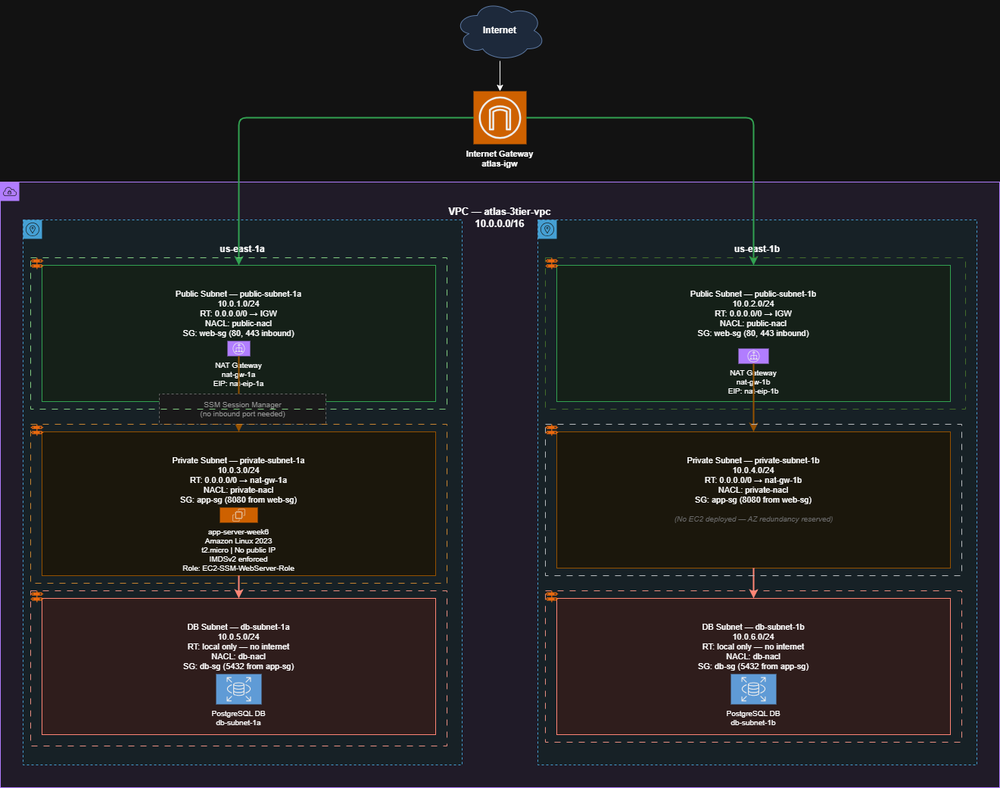
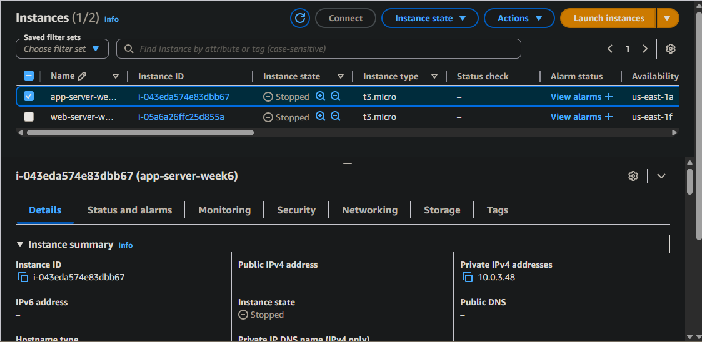
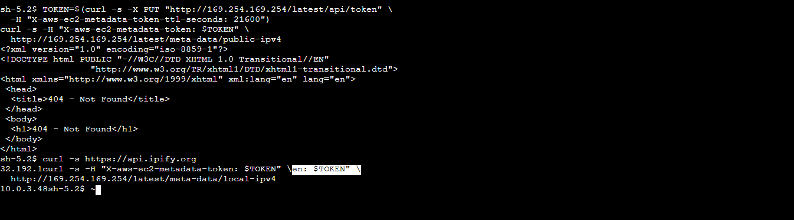

# Week 6 — Secure 3-Tier VPC Architecture
### AWS Cloud Security Roadmap | Geoffrey Muriuki Mwangi

> **Roadmap:** 6-Month AWS Cloud Security Program (March – September 2026)  
> **Week:** 6 of 24 | **Focus:** VPC Deep Dive — 3-Tier Architecture, NAT, Routing, NACLs vs Security Groups  
> **Status:** ✅ Complete — Lab Verified April 13, 2026

---

## Overview

This lab builds a production-realistic, secure 3-tier VPC from scratch across two Availability Zones — covering every layer of network security from routing to NACLs to security group references. An EC2 instance is deployed in the private subnet and outbound connectivity through the NAT Gateway is verified end-to-end.

The goal wasn't just to build a VPC. It was to understand exactly why each control exists — what breaks without it, and what an attacker gains when it's misconfigured.

---

## Architecture Diagram



---

## Architecture Overview

```
Internet
    │
    ▼
[Internet Gateway — atlas-igw]
    │  Bidirectional — public subnets only
    │
    ├─────────────────────────────────────────┐
    ▼                                         ▼
[us-east-1a]                          [us-east-1b]
    │                                         │
[Public Subnet — 10.0.1.0/24]       [Public Subnet — 10.0.2.0/24]
    │  NAT Gateway: nat-gw-1a           │  NAT Gateway: nat-gw-1b
    │  Route: 0.0.0.0/0 → IGW           │  Route: 0.0.0.0/0 → IGW
    │  SG: web-sg (80, 443)             │  SG: web-sg (80, 443)
    │  NACL: public-nacl                │  NACL: public-nacl
    │                                         │
[Private Subnet — 10.0.3.0/24]      [Private Subnet — 10.0.4.0/24]
    │  EC2: app-server-week6             │  No EC2 — AZ redundancy reserved
    │  Route: 0.0.0.0/0 → nat-gw-1a    │  Route: 0.0.0.0/0 → nat-gw-1b
    │  SG: app-sg (8080 from web-sg)    │  SG: app-sg (8080 from web-sg)
    │  NACL: private-nacl               │  NACL: private-nacl
    │                                         │
[DB Subnet — 10.0.5.0/24]           [DB Subnet — 10.0.6.0/24]
    │  Route: local only                 │  Route: local only
    │  SG: db-sg (5432 from app-sg)     │  SG: db-sg (5432 from app-sg)
       NACL: db-nacl                       NACL: db-nacl
```

---

## Security Controls Implemented

| Layer | Control | Implementation | Why It Matters |
|---|---|---|---|
| Network | Route table isolation | DB subnets have no default route | No outbound internet path — data exfiltration impossible even on compromise |
| Network | NAT Gateway per AZ | nat-gw-1a (1a), nat-gw-1b (1b) | Private subnets reach internet outbound only — no inbound path exists |
| Network | NACL per tier | public-nacl, private-nacl, db-nacl | Stateless subnet-level enforcement independent of security groups |
| Instance | Security group references | app-sg references web-sg ID, db-sg references app-sg ID | Precise least-privilege — no IP hardcoding, survives IP changes |
| Instance | IMDSv2 enforced | HttpTokens: required on EC2 | SSRF attacks cannot retrieve IAM role credentials |
| Instance | No public IP | EC2 in private subnet only | No direct internet exposure on the app tier |
| Access | SSM Session Manager | No inbound port required | Shell access without opening port 22 — zero SSH attack surface |

---

## Why Two Availability Zones

Every tier is deployed across two AZs — `us-east-1a` and `us-east-1b`. This matters for two reasons:

**High availability:** Subnets are locked to a single AZ. If `us-east-1a` goes down, everything in `us-east-1b` continues running. Single-AZ deployments are single points of failure.

**NAT Gateway cost architecture:** One NAT Gateway per AZ ensures private subnet traffic stays within its own AZ. Cross-AZ traffic is billed by AWS — routing `us-east-1b` instances through a NAT Gateway in `us-east-1a` incurs unnecessary data transfer costs at scale.

---

## Routing — How Traffic Flows

Route tables determine where every packet goes. The public/private/DB distinction isn't a checkbox — it's entirely determined by the default route.

| Subnet Tier | Default Route | Effect |
|---|---|---|
| Public | `0.0.0.0/0 → IGW` | Bidirectional internet access |
| Private | `0.0.0.0/0 → NAT Gateway` | Outbound internet only — no inbound |
| DB | None | Complete internet isolation |

All tiers share the `local` route (`10.0.0.0/16 → local`) which handles all intra-VPC communication automatically. The most specific route always wins — internal traffic never accidentally hits the default route.

---

## NACLs vs Security Groups

Both controls were applied. They are complementary, not alternatives.

| | Security Group | NACL |
|---|---|---|
| Level | Instance/resource | Subnet |
| State | Stateful — responses automatic | Stateless — both directions explicit |
| Rules | Allow only | Allow and deny |
| Rule evaluation | All rules simultaneously | In order — first match wins |
| Explicit deny | Not possible | Supported |
| Primary use | Fine-grained resource control | Subnet-wide enforcement, IP blacklisting |

**Critical detail — ephemeral ports:** NACLs are stateless. When a client connects to port 80, the response travels back on a random high port (1024–65535) chosen by the client. NACL outbound rules must explicitly allow this ephemeral range or responses are silently dropped. Security groups handle this automatically because they are stateful.

### NACL Rules Per Tier

**Public subnet NACL — public-nacl:**

| Direction | Rule # | Port | Source/Dest | Action |
|---|---|---|---|---|
| Inbound | 100 | 80 | 0.0.0.0/0 | ALLOW |
| Inbound | 200 | 443 | 0.0.0.0/0 | ALLOW |
| Inbound | 300 | 1024-65535 | 0.0.0.0/0 | ALLOW |
| Inbound | * | ALL | 0.0.0.0/0 | DENY |
| Outbound | 100 | 1024-65535 | 0.0.0.0/0 | ALLOW |
| Outbound | * | ALL | 0.0.0.0/0 | DENY |

**Private subnet NACL — private-nacl:**

| Direction | Rule # | Port | Source/Dest | Action |
|---|---|---|---|---|
| Inbound | 100 | 8080 | 10.0.1.0/24 | ALLOW |
| Inbound | 110 | 8080 | 10.0.2.0/24 | ALLOW |
| Inbound | 200 | 1024-65535 | 0.0.0.0/0 | ALLOW |
| Inbound | * | ALL | 0.0.0.0/0 | DENY |
| Outbound | 100 | 80 | 0.0.0.0/0 | ALLOW |
| Outbound | 200 | 443 | 0.0.0.0/0 | ALLOW |
| Outbound | 300 | 1024-65535 | 0.0.0.0/0 | ALLOW |
| Outbound | * | ALL | 0.0.0.0/0 | DENY |

**DB subnet NACL — db-nacl:**

| Direction | Rule # | Port | Source/Dest | Action |
|---|---|---|---|---|
| Inbound | 100 | 5432 | 10.0.3.0/24 | ALLOW |
| Inbound | 110 | 5432 | 10.0.4.0/24 | ALLOW |
| Inbound | * | ALL | 0.0.0.0/0 | DENY |
| Outbound | 100 | 1024-65535 | 10.0.3.0/24 | ALLOW |
| Outbound | 110 | 1024-65535 | 10.0.4.0/24 | ALLOW |
| Outbound | * | ALL | 0.0.0.0/0 | DENY |

---

## Verification

### EC2 Deployed in Private Subnet — No Public IP

Instance `app-server-week6` launched in `private-subnet-1a` with no public IP, no key pair, IMDSv2 enforced, and SSM-only access.



---

### NAT Gateway Connectivity — End-to-End Proof

Three tests run from inside the instance via SSM Session Manager:

**Test 1 — No public IP assigned (IMDSv2):**
```bash
TOKEN=$(curl -s -X PUT "http://169.254.169.254/latest/api/token" \
  -H "X-aws-ec2-metadata-token-ttl-seconds: 21600")
curl -s -H "X-aws-ec2-metadata-token: $TOKEN" \
  http://169.254.169.254/latest/meta-data/public-ipv4
# Returns: 404 — key does not exist, no public IP assigned
```

**Test 2 — Outbound internet via NAT Gateway:**
```bash
curl -s https://api.ipify.org
# Returns: NAT Gateway Elastic IP — not the instance private IP
# Proves NAT translation is working end-to-end
```

**Test 3 — Private IP confirmation:**
```bash
curl -s -H "X-aws-ec2-metadata-token: $TOKEN" \
  http://169.254.169.254/latest/meta-data/local-ipv4
# Returns: 10.0.3.48 — confirmed in private-subnet-1a
```



---

## AWS Resources

| Resource | Name / Value |
|---|---|
| VPC | `atlas-3tier-vpc` — 10.0.0.0/16 |
| Internet Gateway | `atlas-igw` |
| Public Subnets | `public-subnet-1a` (10.0.1.0/24), `public-subnet-1b` (10.0.2.0/24) |
| Private Subnets | `private-subnet-1a` (10.0.3.0/24), `private-subnet-1b` (10.0.4.0/24) |
| DB Subnets | `db-subnet-1a` (10.0.5.0/24), `db-subnet-1b` (10.0.6.0/24) |
| NAT Gateways | `nat-gw-1a` (us-east-1a), `nat-gw-1b` (us-east-1b) |
| Route Tables | `public-rt`, `private-rt-1a`, `private-rt-1b`, `db-rt-1a`, `db-rt-1b` |
| Security Groups | `web-sg`, `app-sg`, `db-sg` |
| NACLs | `public-nacl`, `private-nacl`, `db-nacl` |
| EC2 Instance | `app-server-week6` — Amazon Linux 2023, t2.micro |
| IAM Role | `EC2-SSM-WebServer-Role` |

---

## Key Takeaways

- The public/private/DB distinction is entirely determined by the route table default route — not a label or a setting. Remove the default route from a public subnet and it becomes private instantly.
- NAT Gateway provides outbound-only internet access for private resources. It is not bidirectional. Unsolicited inbound traffic has no path to private instances regardless of security group configuration.
- Security groups do the fine-grained work. NACLs add a stateless subnet-level layer that security groups cannot replicate — specifically explicit deny rules and subnet-wide enforcement independent of instance configuration.
- Ephemeral ports are the most common NACL misconfiguration. Forgetting outbound `1024-65535` causes silent connection failures that look identical to security group misconfigurations at first glance.
- Scoping security group rules to security group IDs rather than CIDR ranges is always the correct production approach. It creates an explicit trust relationship between tiers that survives IP changes and prevents lateral movement from unrelated resources within the same subnet.
- DB subnet isolation means no default route — not just restrictive security groups. An attacker who compromises the DB tier with a route table pointing to NAT can exfiltrate data outbound. Without the route, the data has nowhere to go even on full compromise.

---

*Part of a structured 6-month AWS Cloud Security roadmap building toward cloud security engineering with a DFIR foundation.*  
*GitHub: [Atlas-Ghostshell](https://github.com/Atlas-Ghostshell)*
